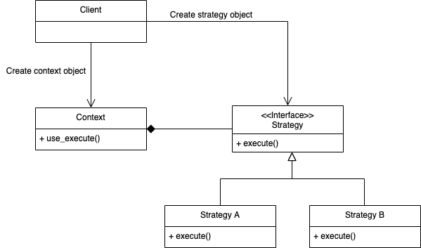

# 디자인 패턴 (Design Paatern)
> 소프트웨어 디자인 패턴(software design pattern)은 소프트웨어 공학에서 소프트웨어 디자인에서 특정 문맥에서 공통적으로 발생하는 문제에 대해 재사용 가능한 해결책이다. 소스나 기계 코드로 바로 전환될수 있는 완성된 디자인은 아니며, 다른 상황에 맞게 사용될 수 있는 문제들을 해결하는데에 쓰이는 서술이나 템플릿이다. 디자인 패턴은 프로그래머가 어플리케이션이나 시스템을 디자인할 때 공통된 문제들을 해결하는데에 쓰이는 형식화 된 가장 좋은 관행이다. - 위키백과


## 전략 패턴(Strategy Pattern)
> 전략 패턴은 하나의 공통 인터페이스를 만들어 여러 가지 전략을 구현한 다음, 상황에 따라 그 전략들을 변환하여 사용할 수 있는 패턴


#### 구성요소
* 전략을 실행하는 객체(Strategy Object) - 실행중 변하는 것
* 전략 객체를 사용하는 사용자(Context) - 변하지 않는 것
* 전략 객체를 사용자(context)에게 공급하는 클라이언트

#### 클래스 다이어그램
<center></center>

#### 구현 with Python
* Strategy pattern에 대해서 Python인 경우 아래와 같이 두가지 구현 방식이 존재함.
    * 클래스 기반
    * 함수 기반

##### &nbsp;&nbsp;&nbsp;&nbsp; 클래스 기반
```python
# context.py
from BehavioralPatterns.StrategyPattern.implements_based_on_class.strategy import Strategy


class Context:
    def __init__(self, strategy: Strategy) -> None:
        self._strategy = strategy

    @property
    def strategy(self):
        return self._strategy

    @strategy.setter
    def strategy(self, strategy: Strategy) -> None:
        self._strategy = strategy

    def do_some_business_logic(self) -> None:
        print("Context: Sorting data using the strategy (not sure how it'll do it)")
        result = self._strategy.do_algorithm(["a", "b", "c", "d", "e"])
        print(",".join(result))

```
* strategy 객체를 공급 받을 수 있도록 @property, @strategy.stter로 strategy() 함수 정의.
* do_some_business_logic() 함수에서 공급 받은 전략 객체 사용.

``` python
# strategy.py
from abc import ABC, abstractmethod


class Strategy(ABC):
    @abstractmethod
    def do_algorithm(self, data):
        pass

```
* strategy 클래스를 추상 클래스로 정의

``` python
# strategy_a.py
from BehavioralPatterns.StrategyPattern.implements_based_on_class.strategy import Strategy


class StrategyA(Strategy):
    def do_algorithm(self, data):
        return reversed(sorted(data))
```
``` python
# strategy_b.py
from BehavioralPatterns.StrategyPattern.implements_based_on_class.strategy import Strategy


class StrategyB(Strategy):
    def do_algorithm(self, data):
        return sorted(data)

```
```python
# client.py
from BehavioralPatterns.StrategyPattern.implements_based_on_class.context import Context
from BehavioralPatterns.StrategyPattern.implements_based_on_class.strategy_a import StrategyA
from BehavioralPatterns.StrategyPattern.implements_based_on_class.strategy_b import StrategyB


if __name__ == '__main__':
    context = Context(StrategyA())
    print("Client: Strategy is set to normal sorting.")
    context.do_some_business_logic()
    print()

    print("Client: Strategy is set to reverse sorting.")
    context.strategy = StrategyB()
    context.do_some_business_logic()

```
* context 객체, strategy 객체를 생성 후 context에 strategy 객체 전달.

##### &nbsp;&nbsp;&nbsp;&nbsp; 함수 기반
```python
import types


class Strategy:
    def __init__(self, func=None):
        self.name = 'Strategy Example 0'

        if func is not None:
            self.execute = types.MethodType(func, self)

    def execute(self):
        print(self.name)


def execute_replacement1(self):
    print(self.name + ' from execute 1')


def execute_replacement2(self):
    print(self.name + ' from execute 2')


if __name__ == '__main__':
    strat0 = Strategy()
    strat1 = Strategy(execute_replacement1)
    strat1.name = 'Strategy Example 1'

    strat2 = Strategy(execute_replacement2)
    strat2.name = 'Strategy Example 2'

    strat0.execute()
    strat1.execute()
    strat2.execute()

```
* python libarary 'types'를 이용하여 객체 단위가 아닌 함수 단위로 전략 패턴 구현 가능.

[참조]
"디자인 패턴 이야기 (1) - 전략 패턴(Strategy Pattern)", Kevin's IT Village, 2019년 03월 25일 접속, https://www.youtube.com/watch?v=azrG8bf5EGA&list=WL&index=93&t=0s