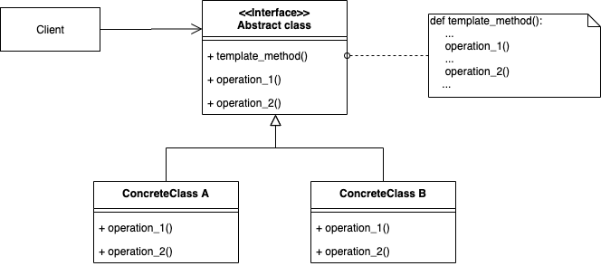

# 디자인 패턴 (Design Paatern)
> 소프트웨어 디자인 패턴(software design pattern)은 소프트웨어 공학에서 소프트웨어 디자인에서 특정 문맥에서 공통적으로 발생하는 문제에 대해 재사용 가능한 해결책이다. 소스나 기계 코드로 바로 전환될수 있는 완성된 디자인은 아니며, 다른 상황에 맞게 사용될 수 있는 문제들을 해결하는데에 쓰이는 서술이나 템플릿이다. 디자인 패턴은 프로그래머가 어플리케이션이나 시스템을 디자인할 때 공통된 문제들을 해결하는데에 쓰이는 형식화 된 가장 좋은 관행이다. - 위키백과


## 템플릿 메소드 패턴(Template Method Pattern)
> 템플릿 메소드 패턴은 알고리즘을 스텝별로 나누어 골격을 구성하고, 알고리즘 골격의 일부 스텝의 구현은 서브 클래스에서 오버라이드 해서 재정의 하도록 하는 패턴

#### 구성요소
* TemplateMethod - 공통적인 로직이 들어가며, 하위 클래스 마다 달라질 수 있는 부분은 추상 메소드로 구성
* 오버라이드 함수 - 상위 클래스에서 정의된 추상 클래스를 하위 클래스에서 상황에 맞도록 구현

#### 클래스 다이어그램
<center></center>

#### 구현 with Python
```python
# template_method.py
from abc import ABC, abstractmethod


class TemplateMethod(ABC):
    def template(self):
        print("AbstractClass says: I am doing the bulk of the work")
        self.operation_1()
        print("AbstractClass says: But I let subclasses override some operations")
        self.operation_2()
        print("AbstractClass says: But I am doing the bulk of the work anyway")

    @abstractmethod
    def operation_1(self):
        pass

    @abstractmethod
    def operation_2(self):
        pass
```
* template 함수에 알고리즘을 스텝으로 나누어 골격화 함.
* 하위 클래스마다 변경이 가능한 스텝은 추상 메소드로 분리 후 호출.

``` python
# concrete_a.py
from BehavioralPatterns.TemplateMethodPattern.implements.template_method import TemplateMethod


class ConcreteA(TemplateMethod):
    def operation_1(self):
        print("ConcreteClass1 says: Implemented Operation1")

    def operation_2(self):
        print("ConcreteClass1 says: Implemented Operation2")
```
```python
# concrete_b.py
from BehavioralPatterns.TemplateMethodPattern.implements.template_method import TemplateMethod


class ConcreteB(TemplateMethod):
    def operation_1(self):
        print("ConcreteClass2 says: Implemented Operation1")

    def operation_2(self):
        print("ConcreteClass2 says: Implemented Operation2")

```
```python
# client.py
from BehavioralPatterns.TemplateMethodPattern.implements.concrete_a import ConcreteA
from BehavioralPatterns.TemplateMethodPattern.implements.concrete_b import ConcreteB


if __name__ == "__main__":
    print("Same client code can work with different subclasses:")
    obj = ConcreteA()
    obj.template()
    print("")

    print("Same client code can work with different subclasses:")
    obj = ConcreteB()
    obj.template()

```